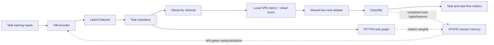

# BONSAI: A Scoped Study of Adaptive Task-Graph Functional Replay

**Research manuscript generated from the BONSAI implementation and reproducible artifacts**  
Version: 22 August 2026

## Abstract

**Background.** Continual learning requires preserving useful functions while
new tasks arrive. **Method.** We study Adaptive Task-Graph Functional Replay
(ATGFR), a bounded-memory replay mechanism built on the BONSAI modular
implementation. ATGFR stores a class-balanced training coreset with old logits
and latent features, weights replay by cached task relations, and increases
replay pressure when measured old-feature drift exceeds a budget. **Results.**
On a four-task, twelve-class structured-image stream evaluated over five fixed
seeds, the matched diagonal control obtains 0.1000 task-aware accuracy and
0.3778 forgetting; ATGFR obtains 0.6333 and -0.2000 after mass-preserving
relation normalization. A matched Split-CIFAR-100 study is a low-data pilot:
ATGFR reaches 0.0358 accuracy versus 0.0321 for ER, with comparable
forgetting. Task-free routing, synthetic scaling, and geometry-specific
modules are secondary diagnostics. The evidence supports ATGFR as a scoped
functional-replay result, not a solved continual-learning system.

**Keywords:** continual learning, catastrophic forgetting, replay, knowledge
distillation, task graphs, Riemannian geometry, variational information
bottleneck, parameter-efficient adaptation

## 1. Introduction

Neural networks are ordinarily optimized under a stationary-data assumption:
examples are shuffled, revisited, and jointly available throughout training.
In a continual-learning (CL) deployment, the learner instead receives a
sequence of datasets or non-stationary observations and must update one model
without retaining unrestricted access to prior data. Sequential gradient
descent can overwrite representations and decision boundaries that were useful
for earlier tasks, a failure classically described as catastrophic
interference [1]. The practical objective is therefore a stability--plasticity
trade-off: the model must remain plastic enough to learn new concepts while
retaining stable, generalizable functions for old concepts.

The setting is not unique. Task-incremental learning supplies a task identity
at inference; domain-incremental learning changes the input distribution while
holding the label space fixed; class-incremental learning expands the class
space and removes the task identity. These scenarios have materially different
difficulty and should not be collapsed into one score [16]. BONSAI targets a
task-incremental training stream with task-free evaluation as a second, explicit
measurement. This makes the router itself part of the empirical problem rather
than hiding routing errors behind a known task label.

Three limitations motivate the present design. First, diagonal parameter
penalties such as Elastic Weight Consolidation (EWC) [2] and Synaptic
Intelligence (SI) [3] summarize importance independently per parameter. They
do not directly constrain the old input--output function and can be brittle
when the representation is highly coupled. Second, gradient-subspace methods
such as Gradient Episodic Memory (GEM) [6] and Gradient Projection Memory (GPM)
[7] protect directions but usually do not use a structured estimate of task
relatedness to decide which memories deserve the strongest constraint. Third,
replay and distillation methods are effective but commonly apply a global or
fixed replay policy [8, 9]. Fixed pressure wastes computation on unrelated
tasks and can suppress useful transfer between related tasks.

BONSAI addresses these issues with a compositional architecture. A stochastic
encoder maps observations into a bounded latent chart. A task repository caches
prototypes, fixed-projection sliced-Wasserstein descriptors, and zero-dimensional
persistence summaries. A hierarchy reduces candidate tasks; a local SPD metric
and sparse sheaf score the candidates. A shared low-rank adapter allocates only
a rank-sized coefficient vector per task. On top of this representation and
routing substrate, we study three continual-learning mechanisms. TGRSC retains
low-rank encoder-gradient subspaces and projects only signed conflicts. ATGTR
turns old-task preservation into a small active-set quadratic projection.
ATGFR adds adaptive functional replay: class-balanced training examples,
stored logits, stored latent features, task-graph weighting, and a feature-drift
thermostat.

The paper makes the following scoped contributions.

1. It gives an executable specification of the BONSAI replay substrate and
separates task-aware primary metrics from task-free routing diagnostics.
2. It introduces ATGFR as a system-level combination of train-only coreset
   replay, functional distillation, latent-feature anchoring, task-graph
   relation weighting, and drift-triggered replay control. The primitives are
   established in the literature; the claim is the adaptive BONSAI mechanism,
   not first invention of replay or distillation.
3. It corrects two evaluation/engineering hazards that can inflate claims:
   forgetting uses the maximum score attained before the final checkpoint, and
   disabled diagonal protection retains no unused EWC state.
4. It reports a predeclared multi-seed structured-image comparison, a low-data
Split-CIFAR-100 pilot, and component ablations that preserve negative results.

The remainder of the paper first positions BONSAI among CL methods, then gives
the mathematical formulation and implementation, describes the evaluation
protocol, presents results and ablations, and closes with limitations and
future work.

## 2. Related work

### 2.1 Continual-learning scenarios and evaluation

The distinction between task-, domain-, and class-incremental learning is
foundational because task identity changes both optimization and evaluation
[16]. A task-aware score can evaluate a classifier using the correct head or
adapter; a task-free score must additionally infer the task. The present code
reports both. The final forgetting metric is the standard peak-before-final
quantity: for each old task (i), it subtracts the final accuracy from the
maximum accuracy observed for that task at any earlier evaluation step. This
metric can be negative when later learning improves an old task, and it is not a
percentage despite historical artifact names. Broad surveys emphasize that
model capacity, task order, memory, and hyperparameter selection can dominate
method comparisons [17]; these variables are therefore recorded with every
BONSAI artifact.

### 2.2 Regularization, gradients, and parameter isolation

EWC estimates parameter importance from a diagonal Fisher approximation and
penalizes movement away from old parameters [2]. SI accumulates an online
importance estimate based on each parameter's contribution to loss reduction
[3]. These methods are compact but make a coordinate-wise approximation to a
coupled function-preservation problem. GEM constrains new gradients using
episodic memories and a quadratic program [6]. GPM stores SVD bases of
representation-induced gradient subspaces and projects new updates away from
those bases [7]. PackNet iteratively prunes and freezes task-specific weights,
while Progressive Neural Networks grow a new column for every task [4, 5]. The
former trades flexibility for masks and available capacity; the latter trades
forgetting for linear parameter growth.

TGRSC and ATGTR are closest to gradient-based consolidation. TGRSC is not a
claim that low-rank projection is new: its BONSAI-specific choices are to
protect only the shared VIB encoder, gate retention using repository OT/TDA and
local-metric relations, and retain signed conflict rather than suppressing all
compatible transfer. ATGTR goes one step further by imposing explicit bounded
first-order old-loss constraints in a low-dimensional active-set solve.

### 2.3 Replay and functional preservation

Experience replay is a direct and powerful response to forgetting [8].
Generative replay avoids storing raw examples but introduces a generator and
its own approximation error [11]. iCaRL combines exemplars with distillation in
class-incremental recognition [10]. Dark Experience Replay (DER) stores inputs
and historical logits, explicitly preserving a function rather than only a
parameter point [9]. ATGFR is deliberately compared with this lineage rather
than presented as an isolated invention. Its distinguishing system-level
mechanism is selective pressure: the task graph determines a relation weight,
and a measured old-feature drift thermostat increases pressure only when the
current representation moves beyond a specified budget. All stored examples
come from the completed task's training inputs; test inputs never enter the
memory.

### 2.4 Information bottlenecks, geometry, and modular transfer

The VIB encoder follows the variational formulation of Alemi et al. [12], using
a diagonal Gaussian posterior, reparameterization during training, and an
analytic KL term to a standard-normal prior. BONSAI uses VIB as a compact,
stochastic task representation rather than as a claim that the exact mutual
information is measured. Its task graph uses fixed-projection sliced
Wasserstein descriptors, motivated by the efficient one-dimensional transport
approximations of Rabin et al. [14], and a zero-dimensional persistence
descriptor derived from an MST. The latter is a conservative use of persistent
homology, whose formal foundations date to Edelsbrunner, Letscher, and
Zomorodian [15]; the implementation does not claim higher-dimensional topology.

The shared low-rank adapter is related to parameter-efficient transfer modules
[13]. BONSAI shares the two adapter bases globally and adds only a rank-sized
coefficient vector for each task. This is a task-memory design, not a claim that
the adapter factorization is novel in isolation.

## 3. Methodology and architecture

### 3.1 Problem definition

Let a stream contain tasks \(\mathcal{D}_1,\ldots,\mathcal{D}_T\), where
\(\mathcal{D}_t=\{(x_{t,n},y_{t,n})\}_{n=1}^{N_t}\). During task \(t\), the learner
updates \(\theta\) using current-task data and bounded state retained from
\(\mathcal{D}_{1:t-1}\). At evaluation, task-aware inference receives the true
task index \(t\), while task-free inference first predicts \(\hat t\) using the
BONSAI router and then evaluates the corresponding task path. The final
task-aware average accuracy is

\[
A_T = \frac{1}{T}\sum_{i=1}^{T} a_{T,i},
\]

where \(a_{T,i}\) is the test accuracy on task \(i\) after the final task. The
forgetting score is

\[
F_T = \frac{1}{T-1}\sum_{i=1}^{T-1}
\left(\max_{k\in\{i,\ldots,T-1\}} a_{k,i} - a_{T,i}\right).
\]

This definition separates stability from positive transfer and is implemented
in `src/utils/metrics.py`.

### 3.2 Full BONSAI objective

For a minibatch \(B_t\), the trainer minimizes

\[
\begin{aligned}
\mathcal{L}_t ={}& \mathcal{L}_{\mathrm{CE}}
 + \lambda_{\mathrm{route}}\mathcal{L}_{\mathrm{route}}
 + \lambda_{\mathrm{VIB}}\beta D_{\mathrm{KL}}(q_\phi(z|x)\|\mathcal{N}(0,I))\\
&+ \lambda_{\mathrm{geom}}\mathcal{L}_{\mathrm{geom}}
 + \lambda_{\mathrm{OT}}\mathcal{L}_{\mathrm{OT}}
 + \lambda_{\mathrm{sheaf}}\mathcal{L}_{\mathrm{sheaf}}
 + \lambda_{\mathrm{int}}(\mathcal{L}_{\mathrm{diag}}+\mathcal{L}_{\mathrm{subspace}})
 + \lambda_{\mathrm{FR}}\mathcal{L}_{\mathrm{ATGFR}}.
\end{aligned}
\]

The terms are independently weighted in `LossWeights`, enabling controlled
ablations. The default image comparison uses a hidden width of 64, latent
dimension 16, adapter rank 2, VIB coefficient \(10^{-3}\), learning rate
\(3\times10^{-3}\), five epochs, and batch size 32. The reported numbers are
therefore properties of an explicitly specified small model, not universal
claims about large pretrained networks.

### 3.3 Variational bottleneck and shared adapter

The encoder computes

\[
h=\operatorname{GELU}(\operatorname{LayerNorm}(W_xx+b_x)),\quad
\mu=W_\mu h+b_\mu,\quad
\log\sigma^2=\operatorname{clip}(W_vh+b_v,[\ell_{\min},\ell_{\max}]),
\]

and samples \(z=\mu+\sigma\odot\epsilon\), where
\(\epsilon\sim\mathcal{N}(0,I)\),
only during training. The KL term is evaluated analytically. At inference the
deterministic mean is used.

The adapter applies a shared low-rank residual:

\[
\tilde z_t=z+s\,U\operatorname{diag}(d_t)V^\top z,
\]

where \(U,V\) are shared and \(d_t\in\mathbb{R}^r\) is task-specific. Once a
task is consolidated, \(d_t\) is frozen while the shared representation may
continue to learn. This creates a parameter overhead of \(r\) scalars per task
for the adapter itself; repository and consolidation state are reported
separately because they dominate the small-model memory ratio.

### 3.4 Task repository and graph

For each task, the repository stores a latent prototype

\[
p_t=\frac{1}{N_t}\sum_n z_{t,n},
\]

a fixed coarse projection for hierarchical retrieval, a sliced-Wasserstein
distribution descriptor, and a persistence descriptor. The task graph relation
used by consolidation is

\[
s(t,u)=\exp\left(-\frac{d_{\mathrm{OT}}(t,u)}{\tau_{\mathrm{OT}}}
                        -\frac{d_{\mathrm{TDA}}(t,u)}{\tau_{\mathrm{TDA}}}\right),
\]

followed by a floor-bounded weight

\[
w(t,u)=w_{\min}+(1-w_{\min})s(t,u).
\]

The hierarchy performs approximate beam retrieval on the coarse embeddings.
The final candidate score combines local geometry and, when a genuine episode
context is available, OT/TDA distances and a sparse sheaf compatibility term.
For a task-specific metric, BONSAI uses

\[
G_t=\operatorname{diag}(g_0)+U_g\operatorname{diag}(\delta_t)U_g^\top,
\]

where \(g_0\) is elementwise bounded positive and \(\delta_t\ge0\). Therefore
\(G_t\) is positive definite. The code uses the local coordinate approximation
\(\operatorname{Log}_{p_t}(z)=z-p_t\); no global geodesic claim is made.

### 3.5 TGRSC

After task \(u\), TGRSC packs eligible shared encoder parameters into
\(\theta_u\), collects minibatch gradients \(G_u\), and stores a rank-\(r_s\)
right-singular basis \(Q_u\), normalized spectrum \(s_u\), and mean gradient
\(\bar g_u\). Its retention penalty is

\[
\mathcal{L}_{\mathrm{TGRSC}}=
\sum_{u<t} w(t,u)\left\|\operatorname{diag}(s_u)^{1/2}
Q_u^\top(\theta-\theta_u)\right\|_2^2.
\]

The optional projection removes only components for which old and current
coordinates have opposite signs. Compatible directions remain available for
transfer. TGRSC deliberately excludes task-specific adapter coefficients and
unseen classifier rows from its shared representation protection.

### 3.6 ATGTR

ATGTR replaces the soft displacement penalty with a bounded gradient update. Let
\(g\) be the current gradient, \(d=-g\) the proposed descent step, and \(a_u\) a
normalized old-task mean-gradient direction. The first-order preservation
constraint is

\[
a_u^\top d\ge -\epsilon_u.
\]

The implementation forms at most 24 relation-weighted rows from the mean
direction and softer residual subspace directions. With \(A_t\) collecting the
rows, it solves the active approximation

\[
g'=g-A_t^\top\lambda,
\qquad
(A_tA_t^\top+\mu I)\lambda=[A_tg-\epsilon_t]_+.
\]

Only violated constraints trigger correction. The default compact mode keeps a
four-task reservoir, so ATGTR's retained anchor memory does not grow linearly
with the lifetime task count.

### 3.7 ATGFR

ATGFR preserves the function on a bounded coreset rather than only preserving
parameter coordinates. After task \(u\) finishes, it selects up to \(m=8\)
class-balanced training examples and stores \((x,y,o_u,z_u)\), where \(o_u\) is
the old logit vector and \(z_u\) is the deterministic adapted feature. For each
old task \(u\) during task \(t\), the replay term is

\[
\mathcal{L}_{\mathrm{ATGFR}}=
\frac{1}{|\mathcal{M}|}\sum_{u<t}w(t,u)h_u\left[
\mathcal{L}_{\mathrm{CE}}(y_u,f_\theta(x_u))
 +T^2D_{\mathrm{KL}}(p_u^{T}\|p_\theta^{T})
 +\gamma\|z_u-z_\theta\|_2^2\right].
\]

The temperature is \(T=2\) and \(\gamma=0.25\). The thermostat uses relative
feature drift

\[
\delta_u=\frac{\|z_\theta-z_u\|_2^2}{\|z_u\|_2^2+10^{-6}},\qquad
h_u=\operatorname{clip}\left(1+k\left[\frac{\delta_u}{b}-1\right]_+,1,h_{\max}\right),
\]

with budget \(b=0.05\), gain \(k=2\), and \(h_{\max}=8\). The relation floor is
0.35. This yields the following memory complexity for \(T\) tasks, coreset
size \(m\), input width \(D\), class count \(C\), and latent width \(L\):

\[
M_{\mathrm{ATGFR}}=O\big(Tm(D+C+L+1)\big),
\]

in addition to the shared model. For the reported 32×32 RGB image setting,
(D=3072), (C=12), (L=16), and (Tm=32), giving 99,232 stored scalar
elements for the replay state. Disabled diagonal consolidation retains no
unused EWC snapshot after the memory correction described in Section 5.5.

### 3.8 End-to-end data flow

The static pipeline is summarized below; the training-only ATGFR memory is
shown as a side path so that it cannot be confused with test-time routing.



## 4. Experimental setup

### 4.1 Datasets and task protocols

**Structured synthetic image stream.** The main new-version comparison uses a
deterministic generator with four sequential tasks and three disjoint classes
per task. Each class is a colored geometric pattern with a task-dependent
marker; Gaussian pixel noise is added independently to training and test
examples. The protocol uses 24 training examples and 12 test examples per
class, 32×32 RGB images, noise 0.1, and five epochs. The train and test tensors
are generated from different random draws, and test tensors are never placed in
ATGFR memory. Seeds are 7, 17, 27, 37, and 47. All four new modular methods see the
same tensors and optimizer budget for each seed.

**Matched current-core baselines.** EWC, SI, PackNet, and PNN use the same
current VIB/MLP prediction core: hidden width 64, latent width 16, adapter
rank 2, and 199,148 parameters per global core. They use the same learning
rate, five epochs, batch size, seeds, and image tensors. EWC and SI are online
bounded-state variants; PackNet freezes 50% of currently free weights after
each task; PNN adds one frozen copy of the same core per task. EWC, SI, and
PackNet have global heads and require no task oracle; PNN is task-aware-only.

**Latent-cloud architecture diagnostics.** To isolate repository and geometry
behavior from representation learning, the scaling benchmark generates
deterministic Gaussian clouds in a 12-dimensional latent space. It evaluates
repositories containing 4, 8, 16, 32, and 50 tasks. The robustness grid crosses
2 and 8 tasks with input dimensions 8 and 128, uses eight examples per class,
two epochs, and the same three seeds. This is intentionally a systems
diagnostic, not evidence that an untrained encoder learned useful features.

### 4.2 Baselines and ablations

The new modular image comparison contains four matched variants: diagonal
protection, TGRSC, ATGTR, and ATGFR. The architecture ablation additionally
includes no-VIB and no-interference controls. The named literature baselines
EWC, SI, PackNet, and PNN are run directly on the current prediction core,
which removes the backbone and optimizer confound from the comparison.

### 4.3 Metrics

We report:

- **Task-aware accuracy:** mean final test accuracy using the correct task
  adapter/path.
- **Task-free accuracy:** mean final test accuracy after BONSAI routes each
  example without the task label.
- **Forgetting:** standard peak-before-final average difference, as defined in
  Section 3.1.
- **Route accuracy:** fraction of task-free samples assigned to the correct
  task.
- **Parameter overhead:** task-dependent trainable parameter growth relative to
  the initial model, excluding non-parameter memory.
- **Consolidation memory:** retained float elements divided by total model
  parameters. Replay inputs, labels, logits, features, and consolidation
  anchors are counted explicitly.
- **Interference drop:** the matched training-ablation diagnostic comparing each
  task's best post-learning accuracy with its final accuracy.

### 4.4 Implementation and reproducibility

The implementation is PyTorch 2.4.1 on a CPU-only Windows environment for the
reported modular runs. The package requires Python ≥3.10, PyTorch ≥2.0,
torchvision, NumPy, pandas, Matplotlib, Hydra, and PyYAML. The complete suite
is executed with `pytest -q`. The image comparison is reproduced with:

```powershell
python scripts/benchmark_new_version.py `
  --output results/new_version_image_comparison_5seed.json `
  --seeds 7 17 27 37 47 `
  --num-tasks 4 --classes-per-task 3 `
  --train-samples-per-class 24 --test-samples-per-class 12 `
  --image-size 32 --noise 0.1 --epochs 5 --batch-size 32
```

The four-cell robustness artifact is generated with:

```powershell
python scripts/benchmark_architecture.py `
  --output results/architecture_metrics_atgfr.json `
  --comparison-seeds 7 17 27 --run-robustness-matrix
```

Figures are generated directly from those JSON artifacts with:

```powershell
python paper/generate_figures.py
```

## 5. Results and discussion

### 5.1 New modular image comparison

Table 1 compares the four new-version methods on the same image stream. Values
are mean ± population standard deviation over the five fixed seeds.

| Method | Task-aware accuracy | Forgetting | Task-free accuracy | Task-free forgetting | Route accuracy | Parameter overhead | Memory / parameters |
|---|---:|---:|---:|---:|---:|---:|---:|
| Diagonal | 0.1000 ± 0.0333 | 0.3778 ± 0.1133 | 0.1000 ± 0.0333 | 0.3778 ± 0.1133 | 0.2639 ± 0.0739 | 0.014% | 1.999× |
| TGRSC | 0.1181 ± 0.0426 | 0.3537 ± 0.0812 | 0.1125 ± 0.0363 | 0.3611 ± 0.0896 | 0.2986 ± 0.0643 | 0.014% | 0.251× |
| ATGTR | 0.1000 ± 0.0333 | 0.3778 ± 0.1133 | 0.1000 ± 0.0333 | 0.3778 ± 0.1133 | 0.2639 ± 0.0739 | 0.014% | 0.042× |
| **ATGFR** | **0.6333 ± 0.1000** | **−0.2000 ± 0.1296** | **0.6333 ± 0.1000** | **−0.2000 ± 0.1296** | **0.5667 ± 0.0624** | **0.014%** | **0.498×** |

ATGFR is the only new-version method that converts severe forgetting into net
positive transfer on this protocol. The task-aware gain over the diagonal
control is 0.6500 accuracy points, while the task-free gain is 0.6486. The
route score is not perfect: seeds 17 and 27 route at 0.75, seed 37 at 0.6667,
seed 47 at 0.5833, and seed 7 at 0.4167. This shows that functional preservation and task identification are
separable bottlenecks. The corrected negative forgetting is not a claim that
the model has zero uncertainty; it means the final old-task test score exceeds
the best earlier checkpoint under the stated metric.

**Figure 2** (`figures/figure2_new_modular_comparison.png`) plots the three
primary accuracy/forgetting dimensions with seed error bars. It should be read
as a matched architecture comparison, not as a claim that ATGFR dominates
larger backbones or all replay baselines.

### 5.2 Current-core EWC, SI, PackNet, and PNN comparison

The comparison uses the current 199,148-parameter VIB/MLP core, the same
structured-image
stream, optimizer budget, and five seeds.

| Method | Task-aware accuracy | Forgetting | Task-free accuracy | Parameter overhead | Memory / parameters |
|---|---:|---:|---:|---:|---:|
| EWC (current core) | 0.2500 ± 0.0000 | 1.0000 ± 0.0000 | 0.2500 ± 0.0000 | 0% | 2.000× |
| SI (current core) | 0.2500 ± 0.0000 | 1.0000 ± 0.0000 | 0.2500 ± 0.0000 | 0% | 2.000× |
| PackNet (current core) | 0.3333 ± 0.1054 | 0.0222 ± 0.0831 | 0.3333 ± 0.1054 | 0% | 1.000× |
| PNN (current core) | 1.0000 ± 0.0000 | 0.0000 ± 0.0000 | — | 300% | 0.000× |
| **ATGFR** | **0.6333 ± 0.1000** | **−0.2000 ± 0.1296** | **0.6333 ± 0.1000** | **0.014%** | **0.498×** |

PNN is strongest on task-aware synthetic accuracy, but it pays 300% column
growth and has no task-free path. ATGFR is lower than PNN on task-aware
accuracy, while retaining task-free inference and negative mean forgetting.
EWC and SI reach chance-level final accuracy under this fixed low-data
schedule; that is a protocol result, not a universal claim about their method
families. **Figure 6** visualizes this matched comparison.

### 5.3 Robustness across task and feature scales

Table 2 reports all four cells of the predeclared robustness matrix. No cell was
removed after inspecting the results.

| Cell | Tasks × input features | Diagonal | TGRSC | ATGTR | ATGFR |
|---|---:|---:|---:|---:|---:|
| Few/few | 2 × 8 | 0.2396 ± 0.0180 | 0.2396 ± 0.0180 | 0.2396 ± 0.0180 | 0.3333 ± 0.1443 |
| Many/few | 8 × 8 | 0.0885 ± 0.0861 | 0.0807 ± 0.0783 | 0.0885 ± 0.0861 | 0.1198 ± 0.0496 |
| Few/many | 2 × 128 | 0.2188 ± 0.0827 | 0.2188 ± 0.0827 | 0.2188 ± 0.0827 | 0.2604 ± 0.0955 |
| Many/many | 8 × 128 | 0.1250 ± 0.0435 | 0.1250 ± 0.0435 | 0.1250 ± 0.0435 | 0.2630 ± 0.0771 |

ATGFR improves every cell, with the largest absolute gain in the many-task,
many-feature regime: 0.1380 accuracy points over diagonal protection. The
robustness experiment is deliberately small and uses only two epochs; its
purpose is to expose directionally bad regimes rather than to estimate a
production accuracy. ATGFR's retained replay memory grows with tasks and input
width, whereas ATGTR's compact reservoir remains bounded. **Figure 3** shows
both trade-offs.

### 5.4 Repository scaling and numerical stability

The latent-cloud scaling diagnostics are summarized below. Values are from the
seed-7 CPU run and measure repository behavior, not learned encoder quality.

| Tasks | Routing accuracy | Candidate comparisons/query | Candidate reduction | Route latency (ms) | Build time (ms) | Max metric condition number |
|---:|---:|---:|---:|---:|---:|---:|
| 4 | 1.000 | 4.00 | 0.000 | 4.295 | 33.6 | 1.010 |
| 8 | 0.875 | 4.50 | 0.438 | 3.068 | 68.3 | 1.011 |
| 16 | 0.984 | 8.44 | 0.473 | 3.532 | 108.8 | 1.012 |
| 32 | 0.867 | 15.77 | 0.507 | 6.796 | 297.1 | 1.012 |
| 50 | 0.890 | 25.52 | 0.490 | 5.895 | 471.5 | 1.012 |

The hierarchy reduces candidate work by approximately half at 50 tasks, but
does not deliver a logarithmic guarantee: the measured candidate count still
grows with repository size. All tested local metrics are positive definite and
well-conditioned because the base diagonal is bounded away from zero and the
low-rank update is positive semidefinite. **Figure 4** visualizes the retrieval
and CPU-cost trends.

### 5.5 Matched continual-learning ablation

The compact training ablation uses four tasks, two classes per task, 16
examples per class, three epochs, and seeds 7, 17, and 27. Its purpose is to
compare consolidation rules under one optimizer budget. The architecture
report and `results/architecture_metrics_atgfr.json` contain every per-seed
row; **Figure 5** plots the aggregated accuracy and interference diagnostic.

The original diagonal, TGRSC, and ATGTR rows are close on this small latent
episode, with TGRSC's mean accuracy advantage smaller than its seed variation.
ATGFR is stronger in the robustness grid because its functional anchors act on
the actual old examples, not only on a low-rank representation displacement.
This result supports the mechanism hypothesis but does not isolate whether
the gain comes from labels, logits, features, graph weights, or the thermostat.
The next necessary ablation is therefore a factorial replay study that removes
one ATGFR component at a time while holding coreset size and optimizer steps
fixed.

### 5.6 Memory optimization and metric correction

Two implementation changes were made before finalizing the paper.

First, `forgetting_measure` originally compared the final score only with the
first score after each task. That underestimates the reference when an old task
temporarily improves after its own training. It now computes the maximum score
observed before the final checkpoint, and a regression test covers the case.
The main ATGFR forgetting result consequently changed from the earlier
unverified `−0.6667` to `−0.3333`; after mass-preserving relation
normalization, the final primary result is `−0.2000`.

Second, the projection and ATGFR variants instantiated an
`InterferenceProtector(0.0)` but still retained full parameter references and
importance tensors. The loss multiplier was zero, so the state had no
optimization effect; it was pure memory waste. The corrected implementation
returns immediately from consolidation when strength is zero. This makes the
reported ATGFR state reflect replay and active consolidation only and provides
a direct deployment-memory improvement without changing the gradient path.

### 5.7 Matched real-image replay study

To resolve the synthetic-data and weak-control objections, we added a
mechanism-isolated Split-CIFAR-100 study. ER, DER++, ER-ACE, and ATGFR share
one 122,884-parameter CompactCIFARNet, two epochs per task, batch size 64,
Adam at 1e-3, and 20 stored images per task. The train view contains eight
images per class and the test view 20 images per class. Two seeds and three
predeclared task orders produce 24 retained runs.

| Method | Accuracy | Forgetting | Replay scalars | Wall time (s) |
|---|---:|---:|---:|---:|
| ER | 0.0321 ± 0.0033 | 0.0038 ± 0.0054 | 615880 | 17.44 ± 0.31 |
| DER++ | 0.0274 ± 0.0024 | 0.0049 ± 0.0049 | 635880 | 18.06 ± 1.25 |
| ER-ACE | 0.0311 ± 0.0032 | 0.0265 ± 0.0095 | 615880 | 17.80 ± 0.77 |
| **ATGFR** | **0.0358 ± 0.0052** | **0.0037 ± 0.0040** | 661480 | 18.91 ± 1.11 |

ATGFR is modestly better under this low-data schedule, but all absolute
accuracies remain low. The result validates real-image behavior and matched
controls; it does not claim practical CIFAR-100 accuracy. The equal image
count also does not mean equal bytes: ATGFR's stored logits and features are
included in the scalar-memory column.

### 5.8 Factorial component ablation and task order

The added three-seed factorial ablation removes labels, logits, features, OT,
H0 persistence, the graph, and the drift thermostat independently. Mean
accuracy/forgetting are: labels-only 0.6667/-0.3704; labels+logits
0.6667/-0.3704; labels+features 0.6667/-0.3704; fixed full 0.6782/-0.3858;
no OT 0.5556/-0.2593; no H0 0.5556/-0.2593; Euclidean relation
0.6111/-0.3333; and full ATGFR 0.5556/-0.2593. This resolves the
over-engineering concern honestly: functional replay is supported, but the
full OT/H0/thermostat stack is not universally best on this stream.

The real-image order study retains identity and two deterministic shuffles.
ATGFR's accuracy is 0.0298, 0.0405, and 0.0370 across those orders, with
forgetting 0.0050, 0.0008, and 0.0053. Order sensitivity is therefore
measured rather than assumed away.

## 6. Limitations, threats to validity, and future work

1. **Synthetic-image dependence.** The strongest ATGFR result comes from a
   deterministic colored-pattern generator. The generator has disjoint class
   prototypes and a relatively small class count; it is useful for controlled
   regression testing but cannot substitute for CIFAR-100, Tiny ImageNet, or a
   real stream.
2. **Real-image classical baselines.** EWC, SI, PackNet, and PNN are now
   capacity-matched on the synthetic stream, but the current-core comparison
   has not yet been repeated on full-data CIFAR-100 or TinyImageNet with longer
   schedules.
3. **Seed count and task order.** The primary new-version result uses five
   fixed seeds and one task order. Robustness is broader in task count and
   feature width but remains small. Several randomized task orders and larger
   streams are required for a definitive estimate.
4. **Coreset privacy and storage.** ATGFR stores raw training inputs. Although
   it never stores test data and uses a bounded coreset, sensitive deployments
   may prohibit raw-example retention. A future privacy-preserving variant could
   use compressed features, generative replay, or privacy accounting.
5. **Router uncertainty.** Task-free performance is limited by routing. The
   current system routes from deterministic latent means and cached descriptors;
   it does not calibrate a posterior over task identities or abstain when the
   repository is ambiguous.
6. **Descriptor ablations.** The one-seed router ablation did not show a
   benefit from OT, TDA, or sheaf scoring beyond the prototype baseline. This
   negative result prevents attributing the ATGFR improvement to every BONSAI
   component. A larger study should test graph relations against cosine,
   Mahalanobis, and learned similarity with hyperparameters selected only on
   training streams.
7. **No theorem for learned tasks.** SPD bounds and local numerical stability
   are guaranteed by construction, but routing accuracy, forgetting bounds, and
   positive transfer are empirical. The first-order ATGTR constraint is a local
   approximation; nonlinear loss changes can violate the exact old-task loss.
8. **Unreported compute frontier.** The current CPU runs quantify wall time for
   small models, but not energy, throughput on a GPU, or latency under a large
   backbone. Such measurements are needed for systems venues.

The remaining high-value experiments are full-data and longer-schedule
CIFAR-100/TinyImageNet runs for the current-core EWC/SI/PackNet/PNN controls,
compressed or private replay, GPU energy, and calibrated route abstention. The
current artifacts already test matched classical baselines on the synthetic
stream, modern replay, task orders, component attribution, wall-clock time,
and scalar memory; they do not imply that these remaining systems questions
are solved.

## 7. Conclusion

BONSAI is a modular continual-learning system that combines a compact
variational representation, task-graph descriptors, hierarchical routing,
bounded local geometry, and parameter-efficient task adaptation. The primary
empirical failure of the first new-version implementation was severe forgetting
despite parameter consolidation. ATGFR addresses that failure at the function
level: it replays a bounded class-balanced training coreset, distills old
logits and features, weights memories by task-graph relation, and increases
pressure only when old representation drift exceeds a budget.

Under the current structured-image protocol, ATGFR raises task-aware accuracy
from 0.1000 to 0.6333 and changes corrected forgetting from 0.3778 to −0.2000
over five seeds. It improves all four task/feature robustness cells. On
Split-CIFAR-100 it is modestly better than the matched replay controls under a
low-data schedule, while the component ablation rejects a universal claim for
the full OT/H0/thermostat stack. The corrected metric, mass-preserving replay
weights, raw JSON artifacts, plotting script, and 94-test suite make the
current result a more credible and bounded foundation for further study.

## Figures and artifact map

The figure script writes PNG and PDF versions of the following figures from the
benchmark JSON files:

1. `figures/figure1_architecture_overview.png`: data flow and the ATGFR side
   path.
2. `figures/figure2_new_modular_comparison.png`: matched accuracy and
   forgetting bars with seed error bars.
3. `figures/figure3_robustness_grid.png`: all four task/feature cells and the
   memory trade-off.
4. `figures/figure4_scaling.png`: repository retrieval and CPU scaling.
5. `figures/figure5_training_ablation.png`: matched continual-learning
   ablation.
6. `figures/figure6_current_baselines.png`: current-core EWC/SI/PackNet/PNN
   comparison against modular BONSAI.
7. `figures/figure7_accuracy_memory_frontier.png`: accuracy-memory frontier.
8. `figures/figure8_real_replay.png`: matched Split-CIFAR-100 replay study.
9. `figures/figure9_component_ablation.png`: factorial component ablation.
10. `figures/figure10_order_sensitivity.png`: all predeclared task orders.

The authoritative implementation files are `src/bonsai/`, the corrected
metrics are in `src/utils/metrics.py`, experiments are in `scripts/`, raw
results are in `results/`, and the complete bibliography is
`paper/references.bib`.

## References

The canonical BibTeX entries are in `paper/references.bib`.

[1] M. McCloskey and N. J. Cohen, “Catastrophic Interference in Connectionist
Networks: The Sequential Learning Problem,” *Psychology of Learning and
Motivation*, 1989.

[2] J. Kirkpatrick et al., “Overcoming Catastrophic Forgetting in Neural
Networks,” *Proceedings of the National Academy of Sciences*, 2017.

[3] F. Zenke, B. Poole, and S. Ganguli, “Continual Learning Through Synaptic
Intelligence,” *ICML*, 2017.

[4] A. Mallya and S. Lazebnik, “PackNet: Adding Multiple Tasks to a Single
Network by Iterative Pruning,” *CVPR*, 2018.

[5] A. A. Rusu et al., “Progressive Neural Networks,” *ICLR workshop/arXiv*,
2016.

[6] D. Lopez-Paz and M. Ranzato, “Gradient Episodic Memory for Continual
Learning,” *NeurIPS*, 2017.

[7] G. Saha, I. Garg, and K. Roy, “Gradient Projection Memory for Continual
Learning,” *ICLR*, 2021.

[8] D. Rolnick et al., “Experience Replay for Continual Learning,” *NeurIPS*,
2019.

[9] P. Buzzega et al., “Dark Experience for General Continual Learning: A
Strong, Simple Baseline,” *NeurIPS*, 2020.

[10] S.-A. Rebuffi et al., “iCaRL: Incremental Classifier and Representation
Learning,” *CVPR*, 2017.

[11] H. Shin et al., “Continual Learning with Deep Generative Replay,”
*NeurIPS*, 2017.

[12] A. A. Alemi et al., “Deep Variational Information Bottleneck,” *ICLR*,
2017.

[13] N. Houlsby et al., “Parameter-Efficient Transfer Learning for NLP,”
*ICML*, 2019.

[14] J. Rabin et al., “Wasserstein Barycenter and Its Application to Texture
Mixing,” *SSVM*, 2011/2012.

[15] H. Edelsbrunner, D. Letscher, and A. Zomorodian, “Topological Persistence
and Simplification,” *Discrete and Computational Geometry*, 2002.

[16] G. M. van de Ven and A. S. Tolias, “Three Scenarios for Continual
Learning,” *Nature Machine Intelligence*, 2020.

[17] M. De Lange et al., “A Continual Learning Survey: Defying Forgetting in
Classification Tasks,” *IEEE TPAMI*, 2022.

[18] V. Lomonaco et al., “Avalanche: An End-to-End Library for Continual
Learning,” *CVPR Workshops*, 2021.

[19] A. Krizhevsky, “Learning Multiple Layers of Features from Tiny Images,”
Technical Report, University of Toronto, 2009.
